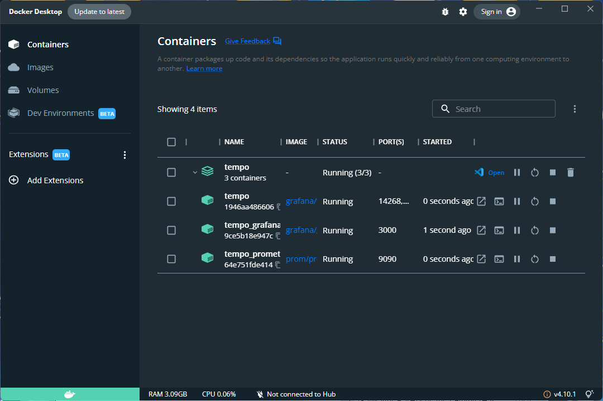



## 템포, 그라파나, 프로메테우스 설치하기 
---
템포 구성 샘플소스 : https://github.com/grafana/tempo.git
>- [docker-compose.yaml](https://github.com/grafana/tempo/blob/main/example/docker-compose/local/docker-compose.yaml)<br>
>- [grafana.yaml](https://github.com/grafana/tempo/blob/main/example/docker-compose/shared/grafana-datasources.yaml)<br>
>- [prometheus.yaml](https://github.com/grafana/tempo/blob/main/example/docker-compose/shared/prometheus.yaml)<br>
>- [tempo.yaml](https://github.com/grafana/tempo/blob/main/example/docker-compose/shared/tempo.yaml)

위 샘플은 도커 컴포즈를 통해서 그라파나, 프로메테우스, 템포를 설치합니다. 

위 깃을 받고 그대로 사용할수 있지만,

딱 필요한 파일만 사용하고 싶다면 아래의 docker-compose.yaml 내용을 복사하고 아래처럼 폴더구조를 생성하여 작업합니다.(상대경로의 변경과 k6 모듈만 제거되었습니다.)

```
├─docker-compose.yaml
├─shared
│   ├─ grafana-datasources.yaml
│   ├─ prometheus.yaml
│   └─ tempo.yaml
└─ tempo-data
```

---
<summary>docker-compose.yaml</summary>

```
version: "3"
services:

  tempo:
    image: grafana/tempo:latest                     #다운받을 이지미
    container_name : tempo                          #생성될 컨테이너 이름
    command: [ "-config.file=/etc/tempo.yaml" ]
    volumes:                                        #볼륨 지정
      - ./shared/tempo.yaml:/etc/tempo.yaml
      - ./tempo-data:/tmp/tempo
    ports:                                          #포트 지정
      - "14268:14268"  # jaeger ingest
      - "3200:3200"   # tempo
      - "4317:4317"  # otlp grpc                    #이전에 만든 닷넷 서버와 통신
      - "4318:4318"  # otlp http
      - "9411:9411"   # zipkin

  prometheus:
    image: prom/prometheus:latest
    container_name : tempo_prometheus
    command:
      - --config.file=/etc/prometheus.yaml
      - --web.enable-remote-write-receiver
      - --enable-feature=exemplar-storage
    volumes:
      - ./shared/prometheus.yaml:/etc/prometheus.yaml
    ports:
      - "9090:9090"

  grafana:
    image: grafana/grafana:9.4.3
    container_name: tempo_grafana
    volumes:
      - ./shared/grafana-datasources.yaml:/etc/grafana/provisioning/datasources/datasources.yaml
    environment:
      - GF_AUTH_ANONYMOUS_ENABLED=true
      - GF_AUTH_ANONYMOUS_ORG_ROLE=Admin
      - GF_AUTH_DISABLE_LOGIN_FORM=true
      - GF_FEATURE_TOGGLES_ENABLE=traceqlEditor
    ports:
      - "3000:3000"
```

---
<summary>각 제품별 yaml 파일(원본이 변경될것을 대비해서)</summary>

- grafana-datasource.yaml

```
apiVersion: 1

datasources:
- name: Prometheus
  type: prometheus
  uid: prometheus
  access: proxy
  orgId: 1
  url: http://prometheus:9090
  basicAuth: false
  isDefault: false
  version: 1
  editable: false
  jsonData:
    httpMethod: GET
- name: Tempo
  type: tempo
  access: proxy
  orgId: 1
  url: http://tempo:3200
  basicAuth: false
  isDefault: true
  version: 1
  editable: false
  apiVersion: 1
  uid: tempo
  jsonData:
    httpMethod: GET
    serviceMap:
      datasourceUid: prometheus
      
traces:
  configs:
    - name: default
      service_graphs:
        enabled: true
```

- prometheus.yaml

```
global:
  scrape_interval:     15s
  evaluation_interval: 15s

scrape_configs:
  - job_name: 'prometheus'
    static_configs:
      - targets: [ 'localhost:9090' ]
  - job_name: 'tempo'
    static_configs:
      - targets: [ 'tempo:3200' ]
```

- tempo.yaml

```
server:
  http_listen_port: 3200

distributor:
  receivers:                           # this configuration will listen on all ports and protocols that tempo is capable of.
    jaeger:                            # the receives all come from the OpenTelemetry collector.  more configuration information can
      protocols:                       # be found there: https://github.com/open-telemetry/opentelemetry-collector/tree/main/receiver
        thrift_http:                   #
        grpc:                          # for a production deployment you should only enable the receivers you need!
        thrift_binary:
        thrift_compact:
    zipkin:
    otlp:
      protocols:
        http:
        grpc:
    opencensus:

ingester:
  max_block_duration: 5m               # cut the headblock when this much time passes.
compactor:
  compaction:
    block_retention: 1h                # overall Tempo trace retention. set for demo purposes

metrics_generator:
  registry:
    external_labels:
      source: tempo
      cluster: docker-compose
  storage:
    path: /tmp/tempo/generator/wal
    remote_write:
      - url: http://prometheus:9090/api/v1/write
        send_exemplars: true

storage:
  trace:
    backend: local                     # backend configuration to use
    wal:
      path: /tmp/tempo/wal             # where to store the the wal locally
    local:
      path: /tmp/tempo/blocks

overrides:
  metrics_generator_processors: [service-graphs, span-metrics] # enables metrics generator
```

Command 창에서 해당 경로로 이동 후 docker-compose up -d 명령으로 컨테이너들을 실행합니다. 

```
docker-compose up -d

```


도커 데스크탑에 아래와 같이 3개의  컨테이너가 실행됩니다. 



닷넷 프로젝트를 컨테이너로 포함시키지 않은 이유
1. Swagger가 개발모드에서만 동작됩니다. 물론 환경변수를 Development로 주면 실행이 됩니다.(ASPNETCORE_ENVIRONMENT=Development)
2. 테스트로 작성할 코드가 서버내부에서 내부 api를 호출하는데, 호출 위치가 컨테이너 내부라서 네트워크 연결하기가 번거롭습니다. (외부 경로나 다른 컨테이너를 호출하면 상관없습니다.)

이 두가지 이유로 닷넷 서버는 로컬에서 실행시켰습니다.